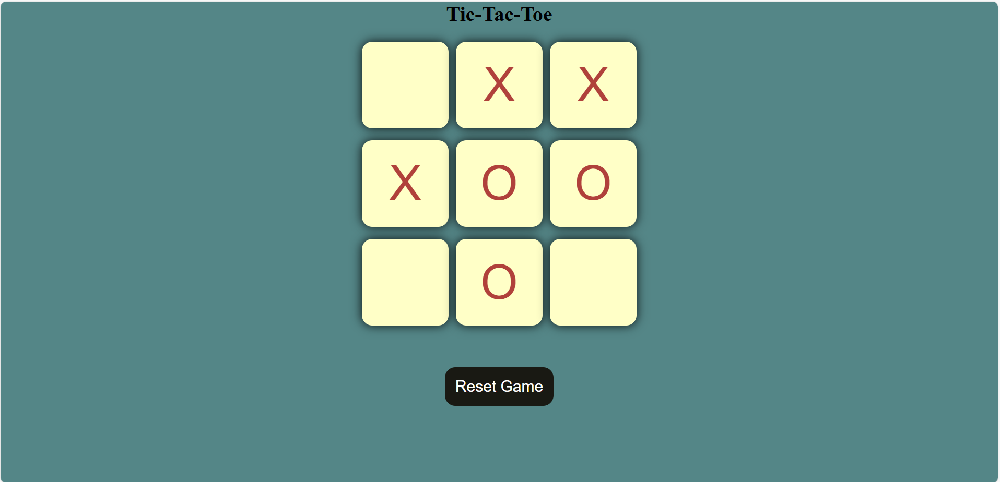

# Tic-Tac-Toe Game

This is a simple implementation of the classic **Tic-Tac-Toe** game for two players. Players alternate turns to place `O` and `X` on a 3×3 grid. The first player to get three of their marks in a row (vertically, horizontally, or diagonally) wins. If all spaces are filled without a winner, it's a **draw**.

---

## Preview

> Here's how the interface looks:



> _Minimalist design, smooth hover effects, and responsive layout.

---

## Tech Stack

- **HTML5** – Game board and structure
- **CSS3** – Styling, layout, shadows, and responsiveness
- **JavaScript** – Game logic (turns, win/draw detection, reset functionality)

---

## How to Run

1. **Clone the repository**:

```bash
git clone https://github.com/bhoomibiradar/tic-tac-toe.git
```

2. **Navigate to project folder**:

```bash
cd tic-tac-toe
```

3. **Run with Live Server** *(recommended)*:
   - Open with VS Code
   - Right-click `index.html` → **Open with Live Server**

4. **OR** simply double-click `index.html` to launch in your browser.

---

## How to Play

1. **Player 1** starts with `O`.
2. Players take turns clicking on empty squares.
3. After each move:
   - The board updates with the symbol.
   - The game checks for a win or a draw.
4. If a player wins or the game ends in a draw, a message is shown.
5. Use the **Reset Game** button to start over.

---

## Features

- **Responsive layout** for desktop and mobile
- **Automatic win/draw detection**
- **One-click reset**
- **Visual feedback for game state**
- **Clean and minimal design**

---

## Author

Made with ❤️ by [Bhoomi](https://github.com/bhoomibiradar)  
[Portfolio Website](https://your-portfolio-link.com)

---

## License

This project is open source and free to use for learning and personal use.
